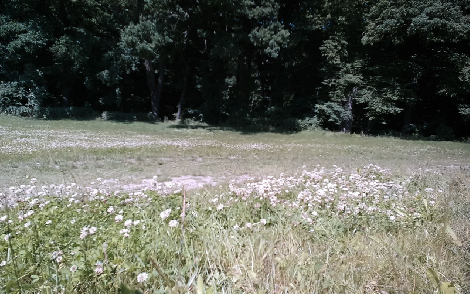
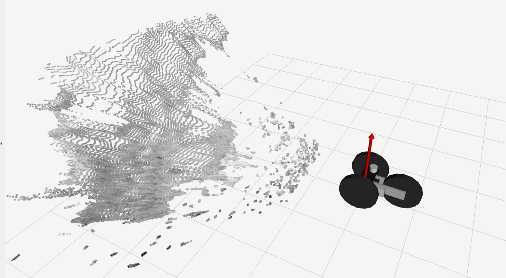
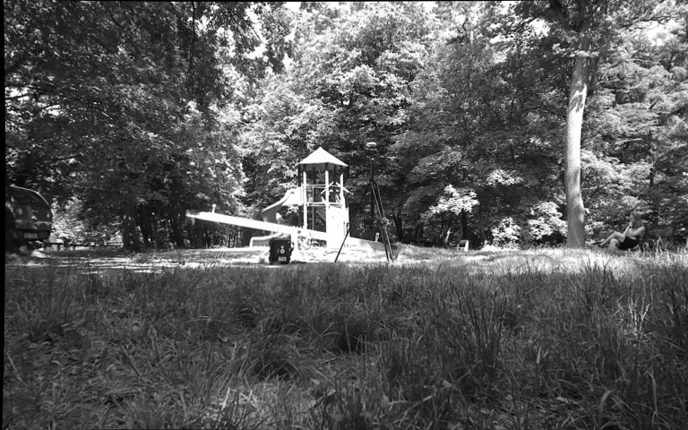
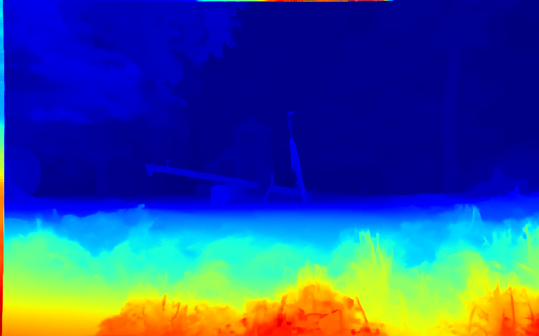

# RGB-D Data Processing

Tools to process RGB-D data collected from the
[Helhest](https://www.helhest.com/) robot equipped with
[Luxonis OAK](https://shop.luxonis.com/collections/oak-cameras-1) depth cameras.

 


## Data

The data sequences are available at the
[subtdata:/data/disparity-refinement](http://subtdata.felk.cvut.cz/disparity-refinement/)
containing:
- disparity maps,
- depth images,
- point clouds,
- rectified left and right colored (grayscale) images,
- calibration files (extrinsics and intrinsics).

 

Please, put the downloaded data into the `rgbd_proc/data` folder.

## Installation

The package is organized as a
[ROS 2](https://docs.ros.org/) package and can be installed using the following commands:

```bash
mkdir -p ~/ros2_ws/src
cd ~/ros2_ws/src
git clone git@github.com:ctu-vras/rgbd_proc.git
cd ~/ros2_ws/
rosdep install --from-path src --ignore-src -r
colcon build --symlink-install --packages-select rgbd_proc
```


## Usage

Make sure to adjust the paths and data topics.

- To view the RGB-D data from a bag file in RViz:
    ```commandline
    ros2 launch rgbd_proc helhest_play.launch.py bag_path:=/path/to/bag rviz:=true
    ```

- To save depth images, corresponding point clouds and colored images, and calibration (extrinsics and intrinsics) from a bag file:
    ```commandline
    ros2 launch rgbd_proc save_data.launch.xml bag_path:=/path/to/bag output_path:=/path/to/save/data
    ```
