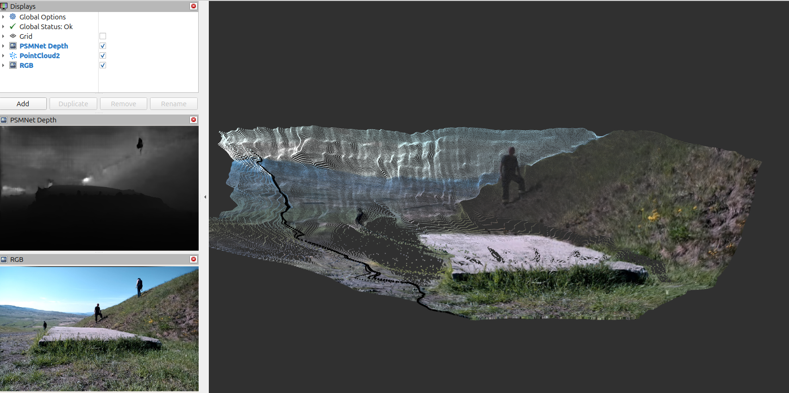

# Depth Estimation

## [PSMNet](https://github.com/JiaRenChang/PSMNet)

### Installation

Make sure to install the [PSMNet dependencies](https://github.com/JiaRenChang/PSMNet?tab=readme-ov-file#dependencies)
and to download the [pretrained model weights](https://github.com/JiaRenChang/PSMNet?tab=readme-ov-file#pretrained-model)
to the `rgbd_proc/config/weights/` folder.

### Running

ROS2 node for the stereo depth estimation using the PSMNet
can be launched with the following command:

```bash
ros2 launch rgbd_proc depth_estimation.launch.xml
```

